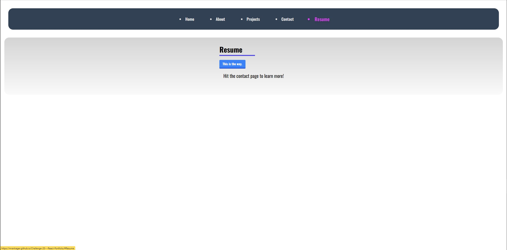

# Challenge-20---React-Portfolio

## Table of contents 

  - [Description](#description) 

  - [Installation](#installation) 

  - [Usage](#usage) 

  - [Questions](#questions) 

  ## Description 
your task is to create a portfolio, using your new React skills to help set you apart from other developers whose portfolios don’t use the latest technologies.

Just as you did in the module project, you’ll need to deploy this application to GitHub Pages. Follow the same instructions that you did for the project to create a build that you can deploy.

Below is a screenshot of how the portfolio appears

  ## Installation 
Run npm i

"@headlessui/react": "^1.7.8",
"@heroicons/react": "^2.0.14",
"@testing-library/jest-dom": "^5.16.5",
"@testing-library/react": "^13.4.0",
"@testing-library/user-event": "^13.5.0",
"heroicons": "^2.0.14",
"react": "^18.2.0",
"react-dom": "^18.2.0",
"react-icons": "^4.7.1",
"react-scripts": "5.0.1",
"web-vitals": "^2.1.4"

devDependencies
"autoprefixer": "^10.4.13",
"gh-pages": "^5.0.0",
"postcss": "^8.4.20",
"tailwindcss": "^3.2.4"

  ## Usage 
A professional portfolio

depolyed link on git hub pages:
https://mrartrager.github.io/Challenge-20---React-Portfolio/

Screenshots:
Home page:

About page:

Projects page:

Contact Page:

Resume Page:

  ## Questions 
 Email: Matthew Waldron
 Github repo: https://github.com/mrartrager/Challenge-20---React-Portfolio
